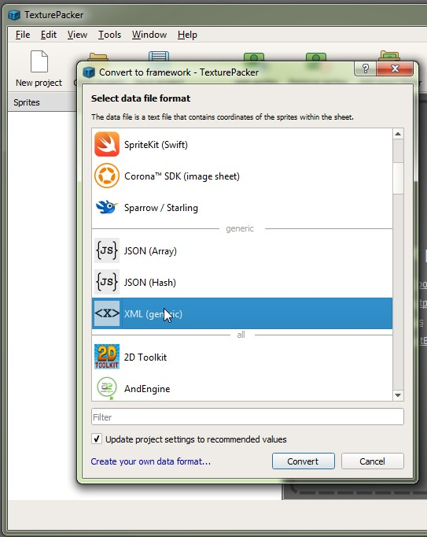

# XMLToFnt
this tool Convert an XML Generic SpriteFrame from TexturePacker to a Bitmap Font File (*.fnt) 

GitHub : https://github.com/aiekick/XMLToFnt

The tool convert basically the xml to the fnt, so the name of the picture of the sprite frame must be the char wanted, except for space char. because we cant name a file with the char ' '.

So all pricture of the sprite frame must have the name of the corresponding ASCII char.
Except for Space shar, and the picture must be called space.

dont forget to trim the name in the TexturePacket option, for avoid have name like space.png in the file.

but feel free to modify what you want :)

TexturePacker => https://www.codeandweb.com/texturepacker

Fnt File format => http://www.angelcode.com/products/bmfont/doc/file_format.html

Tuto : 

Select this file format in TexturePacker :



In the TexturePacker Generic (*.xml) we have that :

 ```
<?xml version="1.0" encoding="UTF-8"?>
<!-- Created with TexturePacker http://www.codeandweb.com/texturepacker-->
<!--Format:
n  => name of the sprite
x  => sprite x pos in texture
y  => sprite y pos in texture
w  => sprite width (may be trimmed)
h  => sprite height (may be trimmed)
pX => x pos of the pivot point (relative to sprite width)
pY => y pos of the pivot point (relative to sprite height)
oX => sprite's x-corner offset (only available if trimmed)
oY => sprite's y-corner offset (only available if trimmed)
oW => sprite's original width (only available if trimmed)
oH => sprite's original height (only available if trimmed)
r => 'y' only set if sprite is rotated
with polygon mode enabled:
vertices   => points in sprite coordinate system (x0,y0,x1,y1,x2,y2, ...)
verticesUV => points in sheet coordinate system (x0,y0,x1,y1,x2,y2, ...)
triangles  => sprite triangulation, 3 vertex indices per triangle
-->
<TextureAtlas imagePath="font.png" width="1008" height="820">
    <sprite n="space" x="884" y="658" w="122" h="160" pX="0.5" pY="0.5"/>
    <sprite n="!" x="2" y="2" w="122" h="160" pX="0.5" pY="0.5"/>
    <sprite n="(" x="128" y="2" w="122" h="160" pX="0.5" pY="0.5"/>
    <sprite n=")" x="254" y="2" w="122" h="160" pX="0.5" pY="0.5"/>
    <sprite n="0" x="380" y="2" w="122" h="160" pX="0.5" pY="0.5"/>
    <sprite n="1" x="506" y="2" w="122" h="160" pX="0.5" pY="0.5"/>
    <sprite n="2" x="632" y="2" w="122" h="160" pX="0.5" pY="0.5"/>
    <sprite n="3" x="758" y="2" w="122" h="160" pX="0.5" pY="0.5"/>
    <sprite n="4" x="884" y="2" w="122" h="160" pX="0.5" pY="0.5"/>
    <sprite n="5" x="2" y="166" w="122" h="160" pX="0.5" pY="0.5"/>
    <sprite n="6" x="128" y="166" w="122" h="160" pX="0.5" pY="0.5"/>
    <sprite n="7" x="254" y="166" w="122" h="160" pX="0.5" pY="0.5"/>
    <sprite n="8" x="380" y="166" w="122" h="160" pX="0.5" pY="0.5"/>
    <sprite n="9" x="506" y="166" w="122" h="160" pX="0.5" pY="0.5"/>
    <sprite n="A" x="632" y="166" w="122" h="160" pX="0.5" pY="0.5"/>
    <sprite n="B" x="758" y="166" w="122" h="160" pX="0.5" pY="0.5"/>
    <sprite n="C" x="884" y="166" w="122" h="160" pX="0.5" pY="0.5"/>
    <sprite n="D" x="2" y="330" w="122" h="160" pX="0.5" pY="0.5"/>
    <sprite n="E" x="128" y="330" w="122" h="160" pX="0.5" pY="0.5"/>
    <sprite n="F" x="254" y="330" w="122" h="160" pX="0.5" pY="0.5"/>
    <sprite n="G" x="380" y="330" w="122" h="160" pX="0.5" pY="0.5"/>
    <sprite n="H" x="506" y="330" w="122" h="160" pX="0.5" pY="0.5"/>
    <sprite n="I" x="632" y="330" w="122" h="160" pX="0.5" pY="0.5"/>
    <sprite n="J" x="758" y="330" w="122" h="160" pX="0.5" pY="0.5"/>
    <sprite n="K" x="884" y="330" w="122" h="160" pX="0.5" pY="0.5"/>
    <sprite n="L" x="2" y="494" w="122" h="160" pX="0.5" pY="0.5"/>
    <sprite n="M" x="128" y="494" w="122" h="160" pX="0.5" pY="0.5"/>
    <sprite n="N" x="254" y="494" w="122" h="160" pX="0.5" pY="0.5"/>
    <sprite n="O" x="380" y="494" w="122" h="160" pX="0.5" pY="0.5"/>
    <sprite n="P" x="506" y="494" w="122" h="160" pX="0.5" pY="0.5"/>
    <sprite n="Q" x="632" y="494" w="122" h="160" pX="0.5" pY="0.5"/>
    <sprite n="R" x="758" y="494" w="122" h="160" pX="0.5" pY="0.5"/>
    <sprite n="S" x="884" y="494" w="122" h="160" pX="0.5" pY="0.5"/>
    <sprite n="T" x="2" y="658" w="122" h="160" pX="0.5" pY="0.5"/>
    <sprite n="U" x="128" y="658" w="122" h="160" pX="0.5" pY="0.5"/>
    <sprite n="V" x="254" y="658" w="122" h="160" pX="0.5" pY="0.5"/>
    <sprite n="W" x="380" y="658" w="122" h="160" pX="0.5" pY="0.5"/>
    <sprite n="X" x="506" y="658" w="122" h="160" pX="0.5" pY="0.5"/>
    <sprite n="Y" x="632" y="658" w="122" h="160" pX="0.5" pY="0.5"/>
    <sprite n="Z" x="758" y="658" w="122" h="160" pX="0.5" pY="0.5"/>
</TextureAtlas>
 ```
 
 and after the exec of tool we have that in a (*.fnt) file:
 
 the header of this file is copy part of existing files i have, so you can customise it according to your needs :)
 
 the tool is just a easier way to get the chars lines..
 ```
info face=font size=72 bold=0 italic=0 charset= unicode= stretchH=100 smooth=1 aa=1 padding=2,2,2,2 spacing=0,0 outline=0
common lineHeight=320 base=320 scaleW=2016 scaleH=1640 pages=1 packed=0
page id=0 file="font.png"
chars count=40
char id=33 x=4 y=4 width=244 height=320 xoffset=0 yoffset=0 xadvance=244 page=0 chnl=15
char id=40 x=256 y=4 width=244 height=320 xoffset=0 yoffset=0 xadvance=244 page=0 chnl=15
char id=41 x=508 y=4 width=244 height=320 xoffset=0 yoffset=0 xadvance=244 page=0 chnl=15
char id=48 x=760 y=4 width=244 height=320 xoffset=0 yoffset=0 xadvance=244 page=0 chnl=15
char id=49 x=1012 y=4 width=244 height=320 xoffset=0 yoffset=0 xadvance=244 page=0 chnl=15
char id=50 x=1264 y=4 width=244 height=320 xoffset=0 yoffset=0 xadvance=244 page=0 chnl=15
char id=51 x=1516 y=4 width=244 height=320 xoffset=0 yoffset=0 xadvance=244 page=0 chnl=15
char id=52 x=1768 y=4 width=244 height=320 xoffset=0 yoffset=0 xadvance=244 page=0 chnl=15
char id=53 x=4 y=332 width=244 height=320 xoffset=0 yoffset=0 xadvance=244 page=0 chnl=15
char id=54 x=256 y=332 width=244 height=320 xoffset=0 yoffset=0 xadvance=244 page=0 chnl=15
char id=55 x=508 y=332 width=244 height=320 xoffset=0 yoffset=0 xadvance=244 page=0 chnl=15
char id=56 x=760 y=332 width=244 height=320 xoffset=0 yoffset=0 xadvance=244 page=0 chnl=15
char id=57 x=1012 y=332 width=244 height=320 xoffset=0 yoffset=0 xadvance=244 page=0 chnl=15
char id=65 x=1264 y=332 width=244 height=320 xoffset=0 yoffset=0 xadvance=244 page=0 chnl=15
char id=66 x=1516 y=332 width=244 height=320 xoffset=0 yoffset=0 xadvance=244 page=0 chnl=15
char id=67 x=1768 y=332 width=244 height=320 xoffset=0 yoffset=0 xadvance=244 page=0 chnl=15
char id=68 x=4 y=660 width=244 height=320 xoffset=0 yoffset=0 xadvance=244 page=0 chnl=15
char id=69 x=256 y=660 width=244 height=320 xoffset=0 yoffset=0 xadvance=244 page=0 chnl=15
char id=70 x=508 y=660 width=244 height=320 xoffset=0 yoffset=0 xadvance=244 page=0 chnl=15
char id=71 x=760 y=660 width=244 height=320 xoffset=0 yoffset=0 xadvance=244 page=0 chnl=15
char id=72 x=1012 y=660 width=244 height=320 xoffset=0 yoffset=0 xadvance=244 page=0 chnl=15
char id=73 x=1264 y=660 width=244 height=320 xoffset=0 yoffset=0 xadvance=244 page=0 chnl=15
char id=74 x=1516 y=660 width=244 height=320 xoffset=0 yoffset=0 xadvance=244 page=0 chnl=15
char id=75 x=1768 y=660 width=244 height=320 xoffset=0 yoffset=0 xadvance=244 page=0 chnl=15
char id=76 x=4 y=988 width=244 height=320 xoffset=0 yoffset=0 xadvance=244 page=0 chnl=15
char id=77 x=256 y=988 width=244 height=320 xoffset=0 yoffset=0 xadvance=244 page=0 chnl=15
char id=78 x=508 y=988 width=244 height=320 xoffset=0 yoffset=0 xadvance=244 page=0 chnl=15
char id=79 x=760 y=988 width=244 height=320 xoffset=0 yoffset=0 xadvance=244 page=0 chnl=15
char id=80 x=1012 y=988 width=244 height=320 xoffset=0 yoffset=0 xadvance=244 page=0 chnl=15
char id=81 x=1264 y=988 width=244 height=320 xoffset=0 yoffset=0 xadvance=244 page=0 chnl=15
char id=82 x=1516 y=988 width=244 height=320 xoffset=0 yoffset=0 xadvance=244 page=0 chnl=15
char id=83 x=1768 y=988 width=244 height=320 xoffset=0 yoffset=0 xadvance=244 page=0 chnl=15
char id=32 x=1768 y=1316 width=244 height=320 xoffset=0 yoffset=0 xadvance=244 page=0 chnl=15
char id=84 x=4 y=1316 width=244 height=320 xoffset=0 yoffset=0 xadvance=244 page=0 chnl=15
char id=85 x=256 y=1316 width=244 height=320 xoffset=0 yoffset=0 xadvance=244 page=0 chnl=15
char id=86 x=508 y=1316 width=244 height=320 xoffset=0 yoffset=0 xadvance=244 page=0 chnl=15
char id=87 x=760 y=1316 width=244 height=320 xoffset=0 yoffset=0 xadvance=244 page=0 chnl=15
char id=88 x=1012 y=1316 width=244 height=320 xoffset=0 yoffset=0 xadvance=244 page=0 chnl=15
char id=89 x=1264 y=1316 width=244 height=320 xoffset=0 yoffset=0 xadvance=244 page=0 chnl=15
char id=90 x=1516 y=1316 width=244 height=320 xoffset=0 yoffset=0 xadvance=244 page=0 chnl=15
 ```

Enjoy :)
